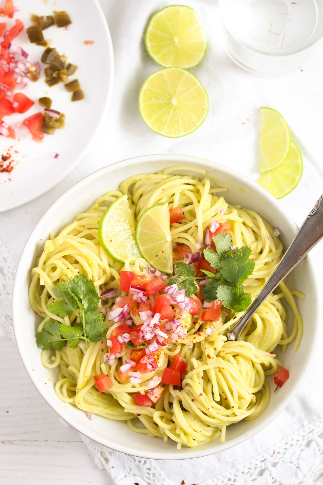

<!-- PROJECT LOGO -->
 

  

  <h3 align="center">Good Food </h3>

  

  A great web application makes it easy for you to find a good recipe based on your preferences. 
      
  

<!-- TABLE OF CONTENTS -->

  
Table of Contents

  <ol>
    <li>
      <a href="#about-the-project">About The Project</a>
    </li>
    <li><a href="#installation">Installation</a></li>
    <li><a href="#contact">Contact</a></li>
  </ol>

<!-- ABOUT THE PROJECT -->
## About The Project

All of us prefer to have a great dinner with a good ingredients. This project allows to find the right recipe for you with the best ingredients just typing only one letter in a search field.

Here's why you need to try it out:
* Extremely easy to use and super user-friedly 
* If you have no idea to cook, just type any letter and application will give you the options to choose!
* Let's cook together!

### Installation

1. Clone this repository
$ git clone ***https://github.com/VAleksandrovich/food-recipes.git***

2. Go into the repository
$ cd food-recipes

3. Run the app
$ npm start

<!-- CONTACT -->

#### Contact

Your Name - [@Linkedin](https://www.linkedin.com/in/volha-aleksandrovich-449831266/) - aleksandrovichvolha@gmail.com

Project Link: [https://opaque-fishy-whimsey.glitch.me)

<!-- MARKDOWN LINKS & IMAGES -->

